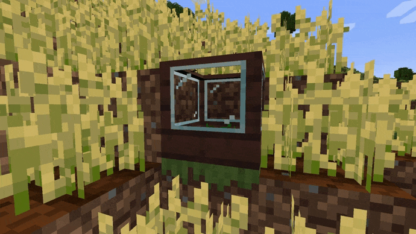

# Arataki's greenhouses

This mod adds a new block, using which you can unload the routine of extracting items of plant origin, because now the greenhouse block will do it for you. Related items and new decorative blocks are also available

### Quick how to use

To simplify the navigation through crafts, we highly recommend installing [REI](https://modrinth.com/mod/rei).

To craft a greenhouse, you need treated planks that can be made from any other planks and buckets of creosote. To get creosote, you need a coke furnace:

One bucket is equal to 3000 mB (millibuckets)
